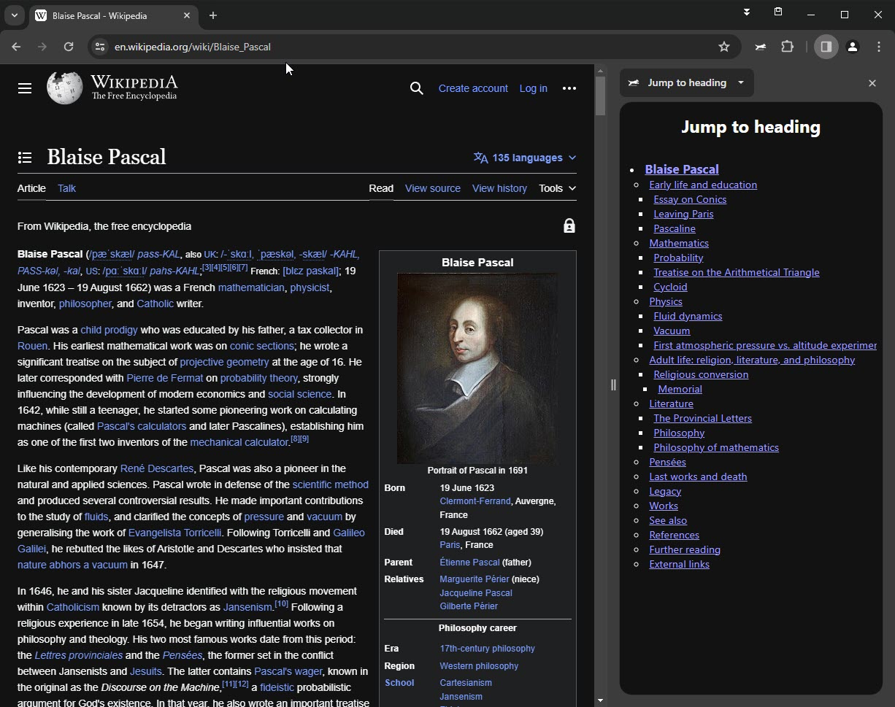

## Jump To Heading

On long documents it can be very hard to find the right content. With this extension you can quickly jump to the right heading.

## Installation

~~The extension is curently in review in the Chrome webstore. Until it'S verified you have to install it via "Load unpacked".~~
**Update:** THe extension is now available in the [web store](https://chromewebstore.google.com/detail/jump-to-heading/hiphkchcchlgbmlfojbibmgmmjnbclnh).

The extension needs access to all URLs, experience shows that the review will take longer with this setting.

## Limitations

- The extension only detects the tags \<H1> to \<H6>. If headings are defined otherwise they will be ignored.

## Attributions

- [Face icons created by Ylivdesign - Flaticon](https://www.flaticon.com/free-icons/face)
